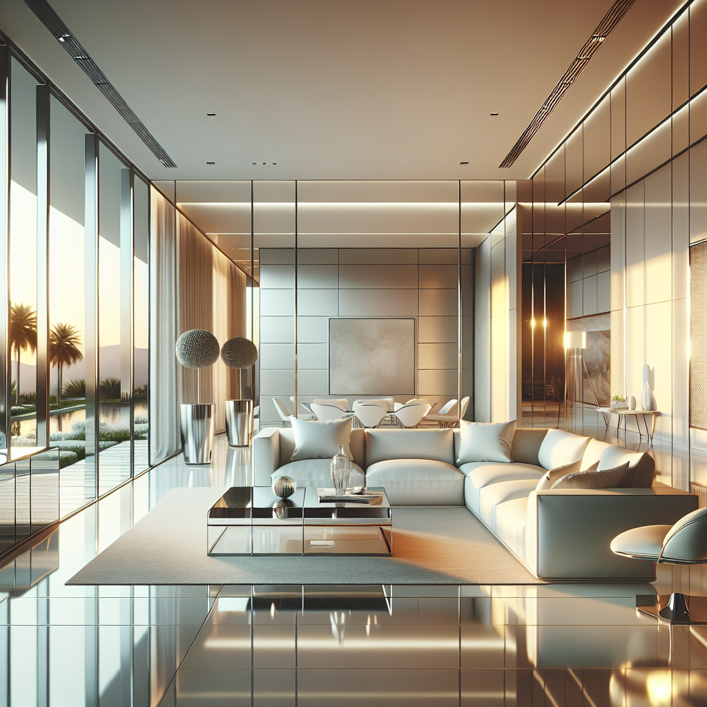

*Description: Modern living room design with a serene and stylish atmosphere. Main color theme is soft off-white, creating a tranquil and pure feeling. The room extensively uses stainless steel and glass elements, enhancing a modern and futuristic feel. The combination of the glossy stainless steel and the transparency of glass reflects the warm light of the sunset, adding depth and dynamism to the space. The layout of the living room is open, perfect for family gatherings or personal relaxation. Additionally, the room features carefully selected modern art pieces and minimalist decor, showcasing a design philosophy that is simple but not simplistic.*

### Generated Assets

