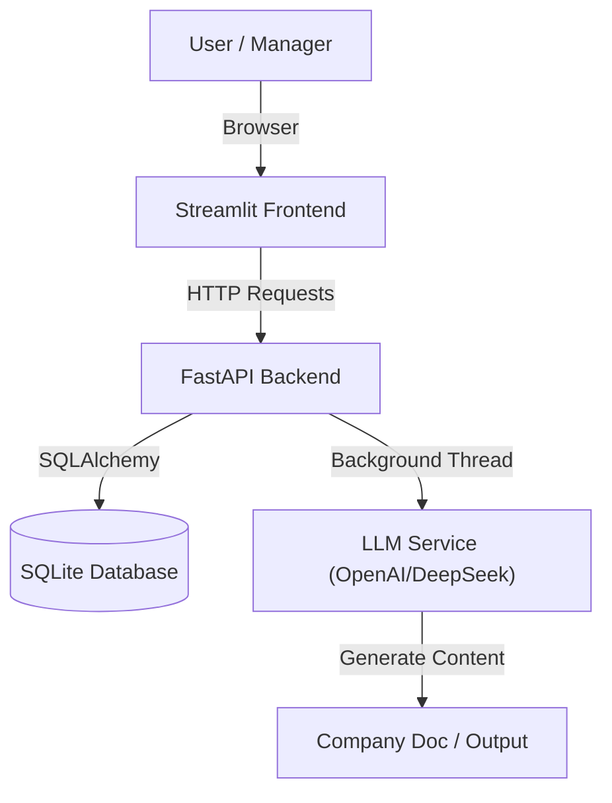

# System Structure & Architecture (系统架构与逻辑)

## 1. High-Level Architecture (总体架构)

The system follows a **Decoupled Client-Server Architecture**:

## 2. Core Modules (核心模块)

### Frontend (`frontend_app.py`)
- **Role**: The User Interface and Orchestrator.
- **Key Functions**:
  - **Agent Center**: Manage (Hire/Fire/Edit) AI Employees.
  - **Meeting Room**: Multi-Agent Chat Interface.
  - **Delegation Logic**: Parses Secretary's `[[DELEGATE]]` tags and triggers chained execution.
  - **Smart Matching**: `find_agent_by_name` ensures robustness in natural language parsing.

### Backend (`backend/app/main.py`)
- **Role**: The Central Nervous System.
- **Key Functions**:
  - **REST API**: Endpoints for Agents, Tasks, Chat, Settings.
  - **Task Queue**: `process_task_background` handles long-running generations.
  - **Dispatch Mode**: A specialized LLM mode that forces strict command execution (ignoring chat history).
  - **Mental Sandbox**: Enforces structured analysis (Intent/Entity/Validation) in System Prompts.

### Database (`company_ai.db`)
- **Schema**:
  - `agents`: Identity, Role, System Prompt.
  - `tasks`: Status, Input Prompt, Output File Path.
  - `skills`: Registered capabilities (e.g., `image_generation`, `read_file`).
  - `agent_skills`: Many-to-Many mapping of Agents to Skills.
  - `logs`: System events and decisions.

### Backend Skills (`backend/app/skills/`)
- **Registry**: Centralized registration of Python functions as AI Tools.
- **Dispatcher**: Regex-based parser to detect `[[CALL_SKILL]]` tags.
- **Built-ins**:
  - `image_generation`: DALL-E 3 integration.
  - `read_file`: Secure file access within `Company Doc` (supports Auto-Discovery).
  - `list_files`: Directory listing.

## 3. Workflow Logic (业务逻辑)

### A. The Delegation Flow (派发流程)

1.  **User Instruction**: "Tell Xiao Ming to write a report."
2.  **frontend**: Sends message to **Secretary (Xiao Fang)**.
3.  **Secretary (Backend)**:
    *   **Step 1: Analyze**: Generates a Markdown Table verifying user intent (Command vs Query).
    *   **Step 2: Act**: If valid, outputs `[[DELEGATE: Xiao Ming | Write report]]`.
4.  **frontend**:
    *   Parses the `[[DELEGATE]]` tag.
    *   Finds `Xiao Ming` in the active agent list (using Fuzzy Match).
    *   Displays: "📣 Delegating to: Xiao Ming".
5.  **Target Agent (Backend)**:
    *   Received `force_execution=True` request.
    *   Enters **Dispatch Mode** (History ignored, strict System Override).
    *   Outputs `[[EXECUTE_TASK: Report | ...content instructions...]]`.
6.  **Task Execution (Background Loop)**:
    *   Backend creates a `Task` record.
    *   Spawns a background thread.
    *   **Multi-Turn Loop (Max 5 Turns)**:
        *   **Turn 1**: Agent generates `[[CALL_SKILL: read_file...]]`.
        *   **System**: Executes skill, returns content to History.
        *   **Turn 2**: Agent sees content, generates `[[CALL_SKILL: image_generation...]]`.
        *   **System**: Generates image, returns URL.
        *   **Turn 3**: Agent synthesizes final report.
    *   Writes final content to `Company Doc/Xiao Ming/Report.md`.

### B. File Generation Protocol (文件生成协议)

All agents are trained to follow this strict protocol:
1.  **Never Chat**: When executing a task, do not output conversational filler.
2.  **Output Tag**: `[[EXECUTE_TASK: Title | Instruction]]`.
3.  **Backend Interception**: The backend listens for this tag and hijacks the process to file generation mode.

## 4. Directory Structure (目录结构)

- **`Company Doc/`**: The "Official Archives". All AI-generated work is saved here, organized by Agent Name.
- **`outputs/`**: System logs and error reports.
- **`backend/`**: Server-side code.
- **`scripts/`**: Utility scripts (e.g., database migration, testing).
